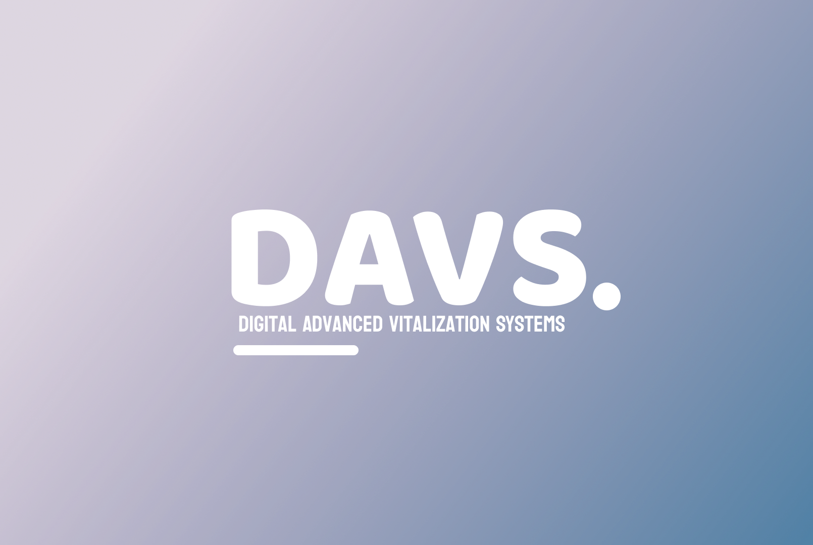

<h1 align="center">Team DAVS</h1>

        

## 🧒 Our Team

<b>
<a href = “https://github.com/SGSkuliev21> 🟨 Angel Angelov [ Backend Developer ] </a> 
<a href=“https://github.com/DKByandov21”> 🟥 Dimitar Byandov [ Fronted Developer ] </a> 
<a href=“https://github.com/VDVichev21”> 🟩 Vicho Vichev [ Backend Developer ] </a> 
<a href =“https://github.com/AHAngelov21”> 🟦 Stoyan Skuliev [ Scrum Trainer ] </a> 
</b>

## 💻 About
 
<b>
Digital Advanced Vitalization Systems (DAVS) revolutionize the concept of wills in the digital era, offering a seamless and secure platform for individuals to manage their digital assets and distribute them according to their wishes. DAVS provides a comprehensive solution for organizing and bequeathing online accounts, cryptocurrencies, social media profiles, and other digital possessions.

</b>
 

## 🗂️Our Technologies

### 👨‍💻Used code editor & collaborative service:

    
    

### 🔨Used tools for our visual elements:

    

### 🔨📄Used tools for our documentation, presentation & communication:

    
    
    
    

 

## 📄Documents

<a href="docs/">QA Documentation </a>

<a href="docs/">Documentation </a>

<a href="docs/">Presentation </a>

<a href="docs/">Test Plan </a>

## 📩 How to Install

To install the repository, you have to type this 👇 in CMD.
<pre>git clone https://github.com/SGSkuliev21/Davs.git</pre>
